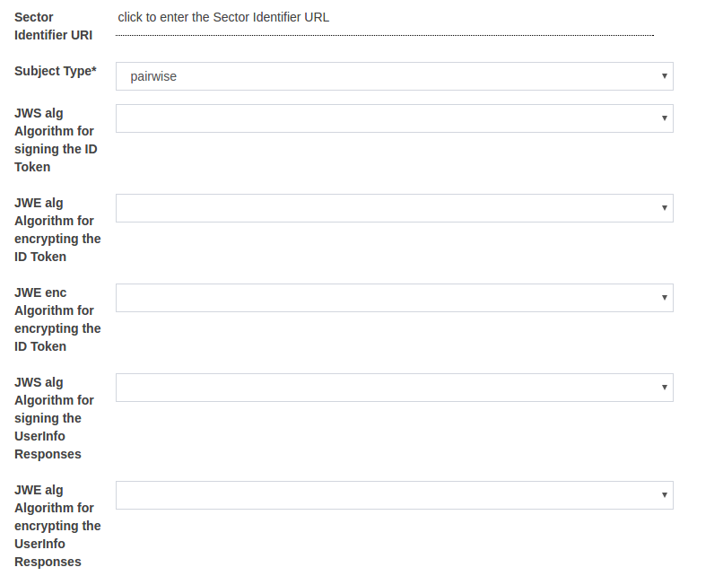
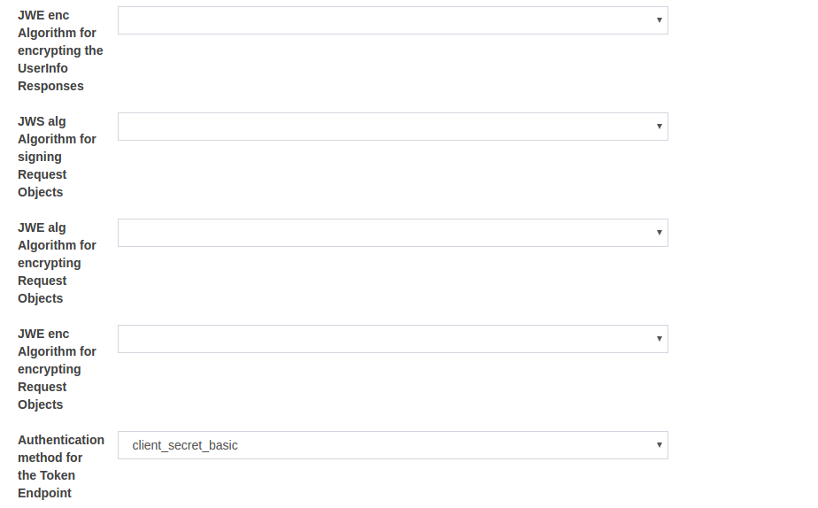
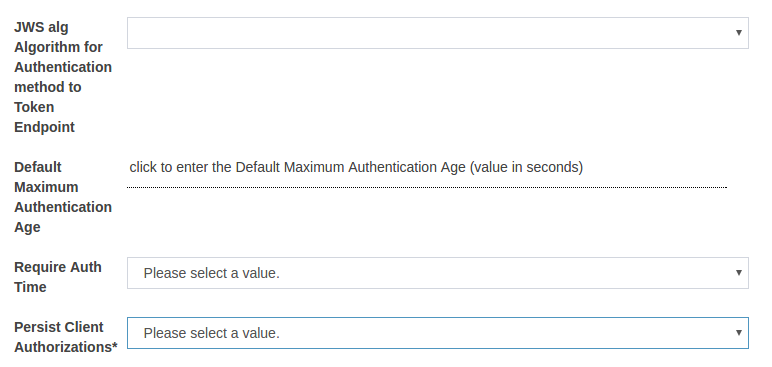
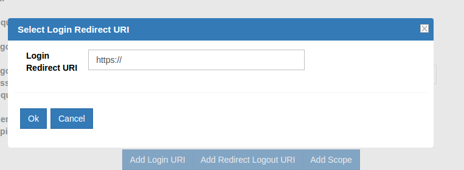
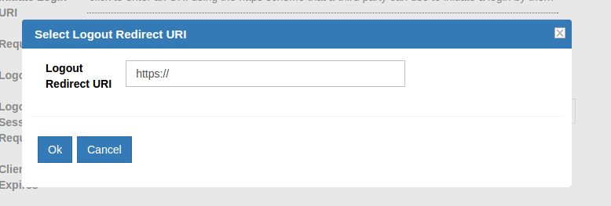
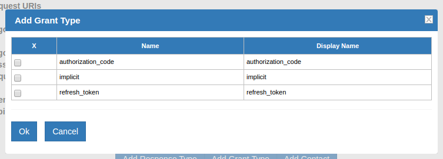
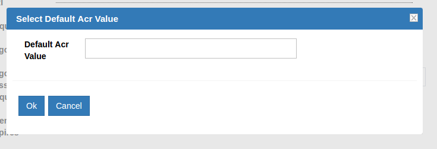
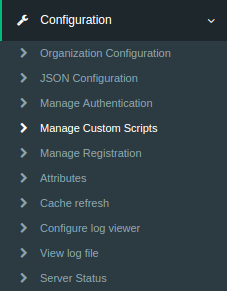

# OpenID Connect 

OpenID Connect is an authentication layer built on OAuth 2.0. 
OpenID Connect is a specific implementation of OAuth 2.0 
where the identity provider holds protected resources that a 
third-party application needs to access on behalf of a person. 
OpenID Connect allows relying parties to verify the identity of, and obtain information about a person requesting to access the applications protected resources. 

## Jargon
In OpenID Connect the key entities include:

- The *end user* (a.k.a. OAuth 2.0 resource owner) whose user information the application needs to access.

The end user wants to login to an application using an existing account at an OpenID Connect identity provider (OP).

- The *Relying Party (RP)* (a.k.a. OAuth 2.0 client) needs access to the end user's protected user information.

For example, an online chat application needs to know who is accessing the application in order to present the correct user account and contacts. 

- The *OpenID Provider (OP)* (a.k.a. OAuth 2.0 authorization server and also resource server) that holds the user information and grants access.

The Gluu Server is an OpenID Provider. The OP holds information about the user and allows the end user or the organization (depending on configuration) to consent to providing the RP with access to user information. OpenID Connect defines a unique identification for an account (subject identifier + issuer identifier), and the RP can use this as a key to its own user profile. 

The relying party can verify claims about the identity of the end user, and log the user out at the end of a session. OpenID Connect also makes it possible to discover the OpenID Provider for an end user, and to register relying party client applications dynamically. OpenID connect services are built on OAuth 2.0, JSON Web Token (JWT), WebFinger and Well-Known URIs.

## OpenID Connect in the Gluu Server
The Gluu Server is a [fully certified OpenID Connect Provider (OP)](http://openid.net/certification/). As an OpenID Provider, the Gluu Server enables OpenID Connect relying parties (clients) to discover its capabilities, handle both dynamic and static registration of relying parties, respond to relying party requests with authorization codes, access tokens, and user information according to the Authorization Code and Implicit flows of OpenID Connect, and manages sessions.

### OpenID Connect Implicit Flow
The OpenID Connect Implicit Flow specifies how the relying party interacts with the OpenID Provider based on use of the OAuth 2.0 implicit grant. The main difference between the OAuth and OpenID Connect implicit flows lie in the use of the id_token, which must be returned in Connect. The id_token adds additional security to the transaction. For more information, read the [OpenID Connect Implicit Client Implementer's guide](http://openid.net/specs/openid-connectimplicit-1_0.html).

### OpenID Connect Authorization Code Flow
The OpenID Connect Authorization Code Flow specifies how the relying party interacts with the OpenID Provider based on use of the OAuth 2.0 authorization grant. The authorization code flow is more secure than the implicit flow because the tokens are never exposed to the web browser and possibly other malicious applications with access to the browser. As with the implicit flow the extra securuty in Connect's authorization code flow stems from the id_token. 

### OpenID Connect Hybrid Flow 
Hybrid flow is a combination of the Implicit Flow and Authorization Code 
Flow. It allows an application to request a combination of identity token, 
access token, and code via the front channel using either a fragment 
encoded redirect (native and JS based clients) or a form post 
(server-based web applications). This enables scenarios where your client
 app can make immediate use of an identity token to get access to the 
 user’s identity, but also retrieve an authorization code that can be 
 used by a back end service to request a refresh token, thus gaining long 
 lived access to resources.

### Discovery 

The first thing you want to know about any OAuth 2.0 API is where the
endpoints are (i.e. what are the URIs where you call the APIs).
OpenID Connect provides a very simple mechanism to accomplish this: 
[OpenID Connect Discovery](http://openid.net/specs/openid-connect-discovery-1_0.html).

In order for an OpenID Connect Relying Party to utilize OpenID Connect
services for an End-User, the RP needs to know where the OpenID Provider is.
OpenID Connect uses [WebFinger](http://en.wikipedia.org/wiki/WebFinger)
to locate the OpenID Provider for an End-User.

Once the OpenID Provider has been identified, the configuration information
for the OP is retrieved from a well-known location as a JSON document,
including its OAuth 2.0 endpoint locations.

#### Sample Discovery Request
If you want to try a discovery request, you can make the following
WebFinger request to discover the Issuer location:

```
GET /.well-known/webfinger?resource=https%3A%2F%2Fidp.gluu.org&rel=http%3A%2F%2Fopenid.net%2Fspecs%2Fconnect%2F1.0%2Fissuer HTTP/1.1
Host: idp.gluu.org

HTTP/1.1 200
Content-Type: application/jrd+json

{
    "subject": "https://idp.gluu.org",
    "links": [{
        "rel": "http://openid.net/specs/connect/1.0/issuer",
        "href": "https://idp.gluu.org"
    }]
}
```

Using the Issuer location discovered, the OpenID Provider's configuration information can be retrieved.

The RP makes the following request to the Issuer `https://<domain>/.well-known/openid-configuration` to obtain its
Configuration information:

```
GET /.well-known/openid-configuration HTTP/1.1
Host: idp.gluu.org

HTTP/1.1 200
Content-Type: application/json

{
    "issuer": "https://idp.gluu.org",
    "authorization_endpoint": "https://idp.gluu.org/oxauth/seam/resource/restv1/oxauth/authorize",
    "token_endpoint": "https://idp.gluu.org/oxauth/seam/resource/restv1/oxauth/token",
    "userinfo_endpoint": "https://idp.gluu.org/oxauth/seam/resource/restv1/oxauth/userinfo",
    "clientinfo_endpoint": "https://idp.gluu.org/oxauth/seam/resource/restv1/oxauth/clientinfo",
    "check_session_iframe": "https://idp.gluu.org/oxauth/opiframe",
    "end_session_endpoint": "https://idp.gluu.org/oxauth/seam/resource/restv1/oxauth/end_session",
    "jwks_uri": "https://idp.gluu.org/oxauth/seam/resource/restv1/oxauth/jwks",
    "registration_endpoint": "https://idp.gluu.org/oxauth/seam/resource/restv1/oxauth/register",
    "validate_token_endpoint": "https://idp.gluu.org/oxauth/seam/resource/restv1/oxauth/validate",
    "federation_metadata_endpoint": "https://idp.gluu.org/oxauth/seam/resource/restv1/oxauth/federationmetadata",
    "federation_endpoint": "https://idp.gluu.org/oxauth/seam/resource/restv1/oxauth/federation",
    "id_generation_endpoint": "https://idp.gluu.org/oxauth/seam/resource/restv1/id",
    "introspection_endpoint": "https://idp.gluu.org/oxauth/seam/resource/restv1/introspection",
    "scopes_supported": [
        "clientinfo",
        "email",
        "openid",
        "profile",
        "address",
        "uma_protection",
        "user_name",
        "uma_authorization",
        "mobile_phone",
        "phone"
    ],
    "response_types_supported": [
        "code",
        "code id_token",
        "token",
        "token id_token",
        "code token",
        "code token id_token",
        "id_token"
    ],
    "grant_types_supported": [
        "authorization_code",
        "implicit",
        "urn:ietf:params:oauth:grant-type:jwt-bearer"
    ],
    "acr_values_supported": [""u2f", "duo", "basic", "mt", "oxpush2", "gplus", "internal"],
    "auth_level_mapping": {"-1": [["internal"]]},
    "subject_types_supported": [
        "public",
        "pairwise"
    ],
    "userinfo_signing_alg_values_supported": [
        "HS256", "HS384", "HS512",
        "RS256", "RS384", "RS512",
        "ES256", "ES384", "ES512"
    ],
    "userinfo_encryption_alg_values_supported": [
        "RSA1_5", "RSA-OAEP",
        "A128KW", "A256KW"
    ],
    "userinfo_encryption_enc_values_supported": [
        "RSA1_5", "RSA-OAEP",
        "A128KW", "A256KW"
    ],
    "id_token_signing_alg_values_supported": [
        "HS256", "HS384", "HS512",
        "RS256", "RS384", "RS512",
        "ES256", "ES384", "ES512"
    ],
    "id_token_encryption_alg_values_supported": [
        "RSA1_5", "RSA-OAEP",
        "A128KW", "A256KW"
    ],
    "id_token_encryption_enc_values_supported": [
        "A128CBC+HS256", "A256CBC+HS512",
        "A128GCM", "A256GCM"
    ],
    "request_object_signing_alg_values_supported": [
        "none",
        "HS256", "HS384", "HS512",
        "RS256", "RS384", "RS512",
        "ES256", "ES384", "ES512"
    ],
    "request_object_encryption_alg_values_supported": [
        "RSA1_5", "RSA-OAEP",
        "A128KW", "A256KW"
    ],
    "request_object_encryption_enc_values_supported": [
        "A128CBC+HS256", "A256CBC+HS512",
        "A128GCM", "A256GCM"
    ],
    "token_endpoint_auth_methods_supported": [
        "client_secret_basic",
        "client_secret_post",
        "client_secret_jwt",
        "private_key_jwt"
    ],
    "token_endpoint_auth_signing_alg_values_supported": [
        "HS256", "HS384", "HS512",
        "RS256", "RS384", "RS512",
        "ES256", "ES384", "ES512"
    ],
    "display_values_supported": [
        "page",
        "popup"
    ],
    "claim_types_supported": ["normal"],
    "claims_supported": [
        "birthdate",
        "country",
        "name",
        "email",
        "email_verified",
        "given_name",
        "gender",
        "inum",
        "family_name",
        "updated_at",
        "locale",
        "middle_name",
        "nickname",
        "phone_number_verified",
        "picture",
        "preferred_username",
        "profile",
        "zoneinfo",
        "user_name",
        "website"
    ],
    "service_documentation": "http://gluu.org/docs",
    "claims_locales_supported": ["en"],
    "ui_locales_supported": [
        "en", "es"
    ],
    "scope_to_claims_mapping": [
        {"clientinfo": [
            "name",
            "inum"
        ]},
        {"email": [
            "email_verified",
            "email"
        ]},
        {"openid": ["inum"]},
        {"profile": [
            "name",
            "family_name",
            "given_name",
            "middle_name",
            "nickname",
            "preferred_username",
            "profile",
            "picture",
            "website",
            "gender",
            "birthdate",
            "zoneinfo",
            "locale",
            "updated_at"
        ]},
        {"address": [
            "formatted",
            "postal_code",
            "street_address",
            "locality",
            "country",
            "region"
        ]},
        {"uma_protection": []},
        {"user_name": ["user_name"]},
        {"uma_authorization": []},
        {"mobile_phone": ["phone_mobile_number"]},
        {"phone": [
            "phone_number_verified",
            "phone_number"
        ]}
    ],
    "claims_parameter_supported": true,
    "request_parameter_supported": true,
    "request_uri_parameter_supported": true,
    "require_request_uri_registration": false,
    "op_policy_uri": "http://ox.gluu.org/doku.php?id=oxauth:policy",
    "op_tos_uri": "http://ox.gluu.org/doku.php?id=oxauth:tos",
    "http_logout_supported": "true",
    "logout_session_supported": "true"
}
```

The following is an example using the [oxAuth-Client](https://ox.gluu.org/maven/org/xdi/oxauth-client/) lib:

```
String resource = "acct:mike@idp.gluu.org";

OpenIdConnectDiscoveryClient openIdConnectDiscoveryClient = new OpenIdConnectDiscoveryClient(resource);
OpenIdConnectDiscoveryResponse openIdConnectDiscoveryResponse = openIdConnectDiscoveryClient.exec();

.....

OpenIdConfigurationClient client = new OpenIdConfigurationClient(configurationEndpoint);
OpenIdConfigurationResponse response = client.execOpenIdConfiguration();
```

See [org.xdi.oxauth.ws.rs.ConfigurationRestWebServiceHttpTest](https://github.com/GluuFederation/oxAuth/blob/master/Client/src/test/java/org/xdi/oxauth/ws/rs/ConfigurationRestWebServiceHttpTest.java)

### Algorithm
oxAuth supports various types of signature and encryption
algorithms for authorizing request parameter passing, ID token signature
and encryption, signing return responses, Encrypt User Info Endpoints
etc.

**Note:** It is a good practice to implement ID Token Signatures with the RSA
SHA-256 algorithm (algorithm value RS256). Additionally, oxAuth also
supports other algorithms that are listed below.

_Available Signature Algorithms:_ none, HS256, HS384, HS512, RS256, RS384, RS512, ES256, ES384, ES512.

_Encryption, Key Encryption Algorithms:_ RSA1_5, RSA-OAEP, A128KW, A256KW.

_Block Encryption Algorithms:_ A128CBC+HS256, A256CBC+HS612, A128GCM, A256GCM,


### OpenID Connect Relying Party Registration
Relying parties can register with the Gluu Server both statically, by the Gluu Server admin, and dynamically, as specified by OpenID Connect Discovery. To allow dynamic registration, you register an initial OAuth 2.0 client that other relying parties can use to get access tokens for registration. You can also enable OpenID Connect relying parties to register dynamically without having to provide an access token. If dynamic registration is enabled, make sure to limit or throttle registrations as it could be used as a form of DDOS.

### Session management

OpenID Connect lets the relying party track whether the end user is logged in at the provider, and also initiate end user logout at the provider. The specification has the relying party monitor session state using an invisible iframe and communicate status using the HTML 5 postMessage API.

However, be forewarned that there is no perfect answer to logout that
satisfies all requirements for all domains on the Internet. For
example, large OpenID Providers, like Google, need a totally stateless
implementation--Google cannot track sessions on the server side for
every browser on the Internet. But in smaller domains, server side
logout functionality can be a convenient solution to cleaning up
resources.

The OpenID Connect [Session
Management](http://openid.net/specs/openid-connect-session-1_0.html) is
still marked as draft, and new mechanisms for logout are in the works.
The current specification requires JavaScript to detect that the session
has been ended in the browser. It works... unless the tab with the
JavaScript happens to be closed when the logout event happens on another
tab. Also, inserting JavaScript into every page is not feasible for some
applications. A new proposal is under discussion where the OpenID
Connect logout API would return `IMG` HTML tags to the browser with the
logout callbacks of the clients. This way, the browser could call the
logout uris (not the server).

The Gluu Server is very flexible, and supports both server side session
management, and stateless session management. For server side
logout, the domain admin can use [Custom Logout scripts](./custom-script.md#application-session-management). This can be
useful to clean up sessions in a legacy SSO system (i.e. SiteMinder), or
perhaps in a portal.

The key for logout is to understand the limitations of logout, and to
test the use cases that are important to you, so you will not be
surprised by the behavior when you put your application into production.

## Manually Register a Client
Gluu Server Administrators can click on the `Add Client` button to register new clients. It is possible to dynamically register any client by calling the dynamic registration endpoint, but this section focuses on the manual registration of the client. The following screen appears when the `Add Client` button is clicked.


* _Client Name:_ This contains the recognizable and unique display name
  of the client. The name of the Client to be presented to the End-User.

* _Client Secret:_ This is the Data Encryption Standard scheme used by
  Confidential Clients to authenticate to the token endpoint. The value for the secret can be inserted manually.

* _Application Type:_ There are two types of applications, Web and
  Native.

	* _Web:_ The Dynamic Client Registration is the default for web. In this type the redirect_uri for implicit grant type must be a real
    hostname with HTTPS. This type is not approved any localhost or HTTP. The web application uses the authorization code flow for clients which
    can maintain a client secret between the uris and the authorization
    server.

	* _Native:_ Custom uri for Native type application have to follow HTTP with localhost. This is suitable for a mobile app which cannot maintain the client secret between itself and the authorization server.

* _Pre Authorization:_ Allow pre-authorized Client Applications 

* _Logo URI:_ The URL of the logo for the client application.
  If present, the server will display this image to the End-User during approval.

* _Client URI:_ The URL of the home page of the client.

* _Policy URI:_ The URL of the Privacy policy.

* _Terms of Service URI:_ The URL to the Terms of Use of the Client.

* _JWKS URI:_ The URL for the Client's JSON Web Key Set.
  
* _JWKS:_ The value of  Client's JSON Web Key Set. The jwks_uri and jwks parameters MUST NOT be used together.



* _Sector Identifier URI:_ URL using the https scheme to be used in calculating Pseudonymous Identifiers by the OP.
  The URL references a file with a single JSON array of redirect_uri values.
  
* _Subject Type:_ The subject type requested for responses to this Client.

* _JWS alg Algorithm for signing the ID Token:_ JWS alg algorithm for signing the ID Token issued to this Client.
  See [Algorithms section](#algorithm) for options.

* _JWE alg Algorithm for encrypting the ID Token:_ JWE alg algorithm for encrypting the ID Token issued to this Client.
  See [Algorithms section](#algorithm) for options.

* _JWE enc Algorithm for encrypting the ID Token:_ JWE enc algorithm for encrypting the ID Token issued to this Client.
  See [Algorithms section](#algorithm) for options.

* _JWS alg Algorithm for signing the UserInfo Responses:_ JWS alg algorithm for signing UserInfo Responses.
  If this is specified, the response will be JWT serialized, and signed using JWS.
  See [Algorithms section](#algorithm) for options.

* _JWS alg Algorithm for encrypting the UserInfo Responses:_  JWE alg algorithm for encrypting UserInfo Responses.
  See [Algorithms section](#algorithm) for options.



* _JWE enc Algorithm for encrypting the UserInfo Responses:_ JWE enc algorithm for encrypting UserInfo Responses. 
  See [Algorithms section](#algorithm) for options.

* _JWS alg Algorithm for signing Request Objects:_ JWS alg algorithm used for signing Request Objects sent to the OP.
  This algorithm is used when the Request Object is passed by value (using the request parameter) and when it is
  passed by reference (using the request_uri parameter).
  The value none can be used.
  See [Algorithms section](#algorithm) for options.

* _JWE alg Algorithm for encrypting Request Objects:_ JWE alg algorithm the RP is declaring that it use for
  encrypting Request Objects sent to the OP.
  See [Algorithms section](#algorithm) for options.

* _JWE enc Algorithm for encrypting Request Objects:_ JWE enc algorithm the RP is declaring that it may use for
  encrypting Request Objects sent to the OP.
  See [Algorithms section](#algorithm) for options.

* _Authentication method for the Token Endpoint:_ Requested Client Authentication method for the Token Endpoint.
  The options are client_secret_post, client_secret_basic, client_secret_jwt, private_key_jwt, and none.
  If omitted, the default is client_secret_basic, the HTTP Basic Authentication Scheme.



* _JWS alg Algorithm for Authentication method to Token Endpoint:_ JWS alg algorithm used for signing the JWT
  used to authenticate the Client at the Token Endpoint for the private_key_jwt and client_secret_jwt
  authentication methods. The value none cannot be used.
  See [Algorithms section](#algorithm) for options.

* _Default Maximum Authentication Age:_ Specifies that the End-User must be actively authenticated if the End-User was
  authenticated longer ago than the specified number of seconds.
  If omitted, no default Maximum Authentication Age is specified.

* _Require Auth Time:_ Specifies whether the auth_time Claim in the ID Token is required.
  If omitted, the default value is false.

* _Persist Client Authorizations*:_ Specifies whether to persist user authorizations.


* _Initiate Login URI:_ URI using the https scheme that a third party can use to initiate a login by the RP.

* _Request URIs:_ Array of request_uri values that are pre-registered by the RP for use at the OP.
   The Server cache the contents of the files referenced by these URIs and not retrieve them at the time they are used in a request.

* _Logout URIs:_ Redirect logout URLs supplied by the RP to which it can request that the End-User's
  User Agent be redirected using the post_logout_redirect_uri parameter after a logout has been performed.

* _Logout Session Required*:_ Specifies whether the RP requires that a sid (session ID) query parameter
  be included to identify the RP session at the OP when the logout_uri is used.
  If omitted, the default value is false.

* _Client Secret Expires:_ Time at which the client will expire or 0 if it will not expire.

* _Add Login URI:_ This option can be used to add the login URL.


* _Add Redirect Logout URI:_ The logout request, if requires a redirection can be added here.


* _Add Scopes:_ This option can be used to add the required scopes in the Gluu Server.
The available scopes can be listed by hitting the *Search* button, and
  keeping the search phrase blank. Furthermore, from this the Gluu Server administrator can select the required scopes.

* _Add Response Type:_ There are three types of responses in the Gluu
  Server and they are Code, Token and ID Token. The Gluu Server
  Administrator can select all of them for testing purposes.


* _Add Grant Type:_ There are 3 grant type available in this option `authorization_code, implicit, refresh_token`


* _Add Contact:_ Use this option to add the email address for the Client contact

* _Add Default ACR value:_ The default ACR Value is defined through this option and it is used to include multi-factor authentication in registered clients. Please use this option to define which from of authentication to use for specific client. See section 3.3.2.1 for details.


* _Add Request URI:_ Use this option to add the Request URI

* _Add Logout URI:_ Use this option to add the logout URI.

### Multi-Factor Authentication for Clients
The `acr_values` parameter is used to specify the use of specific multi-factor authentication for each client. If a scenario is presented where different clients use different authentication mechanism, then the `acr_value` parameter is used to specify the choice. Out of the box, the Gluu Server supports U2F, DUO, Basic, oxPush/SuperGluu, Google+ and internal LDAP authentication. While registering a new client, put the mode in `Add Default ACR value` to chosen mechanism. The authentication mechanism must be enabled in the `Custom Scripts` section as well.

Out-of-the-box supported ACR Values in Client Registration include: "u2f", "duo", "basic", "mt", "oxpush2", "gplus", "internal". The table below explains the acr values. Please click on the description to access the specific how-to guide for implementing the ACR declared authentication.

|  ACR Value  	| Description			|
|---------------|-------------------------------|
|  u2f		| [FIDO U2F Device](../multi-factor/u2f)|
|  duo		| [Duo soft-token authentication](../multi-factor/duo)|
|  basic	| Username/Password authentication from LDAP Server|
|  oxpush2	| [Multi-factor authentication](../multi-factor/oxpush2)|
|  gplus	| [Google+ authentication](../customize/social-login-google)|
|  internal	| Use Gluu Server LDAP to authenticate users|

### Algorithm
oxAuth supports various types of signature and encryption
algorithms for authorizing request parameter passing, ID token signature
and encryption, signing return responses, Encrypt User Info Endpoints
etc.

**Note:** It is a good practice to implement ID Token Signatures with the RSA
SHA-256 algorithm (algorithm value RS256). Additionally, oxAuth also
supports other algorithms that are listed below.

_Available Signature Algorithms:_ none, HS256, HS384, HS512, RS256, RS384, RS512, ES256, ES384, ES512.

_Encryption, Key Encryption Algorithms:_ RSA1_5, RSA-OAEP, A128KW, A256KW.

_Block Encryption Algorithms:_ A128CBC+HS256, A256CBC+HS612, A128GCM, A256GCM,

## Custom Client Registration

Using interception scripts you can customize client registration
behavior. For example, by default oxAuth allows new clients to access to
default scopes only. With a custom client registration interception
script it is possible to allow access to more scopes. For instance, we
can use `redirect_uri` to determine if we need to allow access to
additional scopes or not.

To access the interface for custom scripts in oxTrust, navigate to
Configuration --> Custom Scripts --> Custom Client Registration.




The script is [available here](./sample-client-registration-script.py)

## Client Software to Secure Applications
Although you can use generic OAuth 2.0 client libraries to call OpenID Connect endpoints, you would have to implement code to take advantage of some of OpenID Connect's features. For example, there is no id_token in OAuth 2.0, so you won't find any code for id_token validation in an OAuth 2.0 library. A good OpenID Connect client will do much of the heavy lifting for you. 

### JavaScript Client
A JavaScript client is one of the easiest ways to use OpenID Connect, although it's not the most secure. The client we recommend was forked from a sample application written to demonstrate how easy it is to use Connect. Gluu forked the code, and has enhanced it since the time of its original publishing. The project can be found on [Github](https://github.com/GluuFederation/openid-implicit-client).

It's not a fancy app--it sends the person to the authorization endpoint to be authenticated, and then prints the claims tha are returned in the id_token. Currently the client does not handle dynamic client registration. 

You'll have to add the client manually to the Gluu Server via the GUI. When completing the `add client` form, you can use the following configuration:

```
Client Name: Implicit Test Client
response_type: token id_token
Application Type: Web
Pre-Authorization: Enabled
Subject Type: public
Scopes: openid, profile, email
Response Types: token id_token
Grant Types: implicit
```

Once you have registered the client in the Gluu Server, all you need to do is update the `client_id`, `redirect_uri`, and `providerInfo` values in the login page html. Assuming you've checked out the project into a web accessible folder, then navigate to the page and test! 

### Server-Side libraries
Many applications are "server-side", meaning the web page displays content but most of the dynamic business logic resides on the web server. The OpenID Foundation maintains a list of client libraries on [their website](http://openid.net/developers/libraries). However, our experience has been that the quality of these libraries varies widely. Some are not well documented, other are not updated frequently, and some do not implement essential security features available in OpenID Connect. In addition, if a wide array of client libraries are used it becomes difficult to monitor and patch security vulnerabilities. For this reason, we recommend that you use our OpenID Connect middleware software called [oxd](http://oxd.gluu.org).  

oxd is not open source, but it is very reasonably priced at $0.33 per day per server--or ~$10/month. The code is available on [GitHub](https://github.com/gluufederation/oxd), and there are free open source oxd libraries available for PHP, Java, Python, C#, Node, Ruby, Perl and Go. There are also plugins available for several popular open source applications.

[Watch the oxd demo](http://gluu.co/oxd-demo).

[Get an oxd license for free](http://oxd.gluu.org)

### Apache HTTPD module
A popular approach to protecting web applications is to use a web server filter to intercept the request, and make sure the person using that connection is authenticated and authorized. The web server with the filter may directly serve the application, or may proxy to a backend service. Leveraging the web server is a well established pattern, used by older access management platforms like CA Siteminder and Oracle Access Manager. 

One of the advantages of the web server filter approach is that the application developer does not need to know that much about the security protocols--if the request makes it through to the application, the person has been authenticated and the request is authorized. Another advantage is that the application security is administered by the system administrators, not by developers. For example, it may be easier to manage and audit apache configuration than to read a bunch of code. 

One of the best OpenID Connect relying party implementations was written by Hans Zandbelt, called [mod_auth_openidc](https://github/com/pingidentity/mod_auth_openidc). It is an authentication and authorization module for the Apache 2.x HTTP server that authenticates users against an OpenID Connect Provider (OP). The software can be found on GitHub and is included in the package management system for several Linux distributions. There are binary packages available, and if you are good at compiling C code, you can build it yourself from the source. 

Note: if you are an Nginx fan, there is a similar [Lua implementation](https://github.com/pingidentity/lua-resty-openidc) to make NGINX operate as an OpenID Connect RP or OAuth 2.0 RS. 

### AppAuth for Mobile Applications
One of the most compelling reasons to use Connect is to authenticate people from a mobile application. The IETF draft ["OAuth 2.0 for Native Apps"](https://tools.ietf.org/html/draft-ietf-oauth-native-apps-06) provides an overview of an improved design for mobile security. In additio to the security features of OpenID Connect, this draft suggests the use of a PKCE and custom URI schemes (i.e. an application can register a URI such as myapp:// instead of https://).

In 2016, Google released and then donated code to the OpenID Foundation called AppAuth for [Android](https://github.com/openid/AppAuth-android) and [iOS](https://github.com/openid/AppAuth-iOS). The AppAuth projects also include sample applications. Simulataneously, Google announced that it was deprecating the use of WebViews--a strategy used by mobile app developers which is vulnerable to malicious application code. Not only does AppAuth provide secure authentication, it enables SSO across the system browser and mobile applications. It accomplishes this by leveraging new operating system features that enable the system browser to be called by an application in an opaque view that does not enable an app developer to steal a person's credentials, or other applications to steal codes or tokens. Using this approach, mobile app developers can use the authorization code or hypbrid flow (as described earlier). 

The Gluu Server is the only free open source OpenID Connect Provider that currently supports AppAuth. 

## oxAuth RP

The Gluu Server ships with an optional OpenID Connect relying 
party web application, which is handy for testing.  
It's called oxauth-rp. During Gluu Server setup, you'll be asked if you 
want to install it--which you should on a development environment. 
It will be deployed on `https://<hostname>/oxauth-rp`. Using this tool 
you can exercise all of the OpenID Connect API's, including discovery, 
client registration, authorization, token, userinfo, and end_session. 

