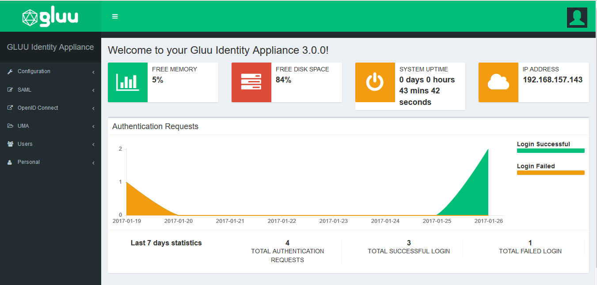
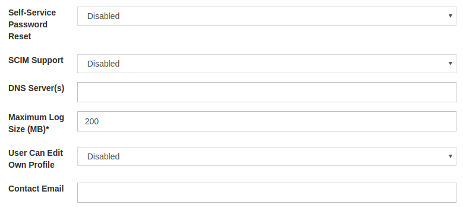
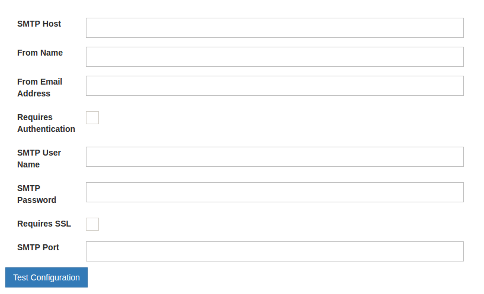
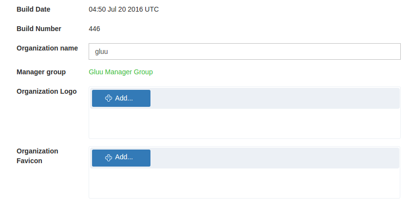
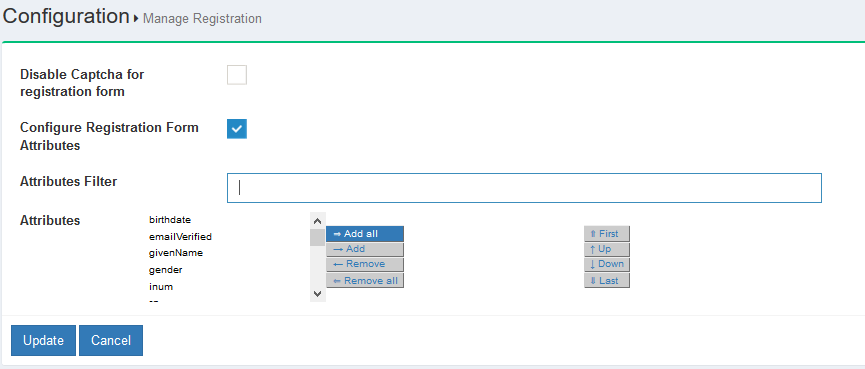
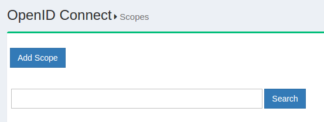
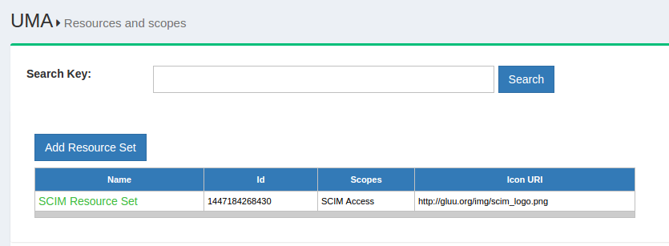

# oxTrust Administrative Graphical User Interface (GUI)
The administration interface (oxTrust) is accessible by navigating to 
`https://hostname` (the one you provided during setup.) When you 
first complete an installation, the default username is `admin` and 
the password is the same as the `LDAP superuser` password.

## Welcome Page
After successful authentication the administrator is taken to the 
Dashboard. Some basic information about the VM/server is displayed as 
well as the server version, free memory, and disk space. In the top 
right there is a user icon which you can log out of oxTrust. 
The left hand menu is used to navigate the admin interface.

## Configuration   

From the configuration tab, the Gluu Server administrator can manage 
certain non-protocol related tasks.

### Organization Configuration

There are three sections in the organization configuration page:       

1. [System Configuration](#system-configuration)         
2. [SMTP Server Configuration](#smtp-server-configuration)         
3. [oxTrust Settings](#oxtrust-settings)             

#### System Configuration

- Self-service password reset: Allow users to reset their password via email. In order for this feature to work, the admin will also need to perform [SMTP Server Configuration](#smtp-server-configuration).      

- SCIM Support: Enable SCIM Support if you plan on using the SCIM protocol to move identity data from applications to Gluu and vice versa.      

- DNS Server(s): If the organization uses any custom `DNS Server(s)`, the address should be added here. 

- Maximum Log Size (MB): By default the maximum size of the log file is 200 mb. This value can be increased or decreased depending on the organizations requirements.     

- User can edit their own profile: oxTrust has a profile section for each user. If this option is enabled, users will be able to log into oxTrust and edit the values associated with their user.      

- Contact Email: This email will be displayed on all error pages with a note instructing users to contact for troubleshooting and  assistance.        

#### SMTP Server Configuration     

The Gluu Server needs a mail server in order to send notifications. The fields on this parge are self-explanatory and simple such as hostname, user, password, ssl-requirement, authentication requirement, sending name and address. All fields on this page are manadory and the configuration can be tested before confirmation.
     
#### oxTrust Settings  

From the oxTrust Settings page the administrator can find the oxTrust build date and number, and change the organization name, logo, and favicon settings. This page also contains the name of the Gluu Server administrator group. Users added to this group will have administrator access to the Gluu Server.

### JSON Configuration      
The configuration files are accessible from the administrator interface (oxTrust). 
There are three tabs under the `JSON Configuration` menu:

#### oxTrust Configuration
The oxtrust JSON configuration file is accessible from this tab and it can be edited from this page. The changes are updated by clicking on the `Update` button on the bottom of the page. 

#### oxAuth Configuration
The oxAuth JSON configuration page gives easy access to the different endpoints used by Gluu Server CE. This page also contains the supported response, grants and algorithms among other information. The details will follow later on this documentation.

#### oxTrust Import Person Configuration
The oxTrust Import Person Configuration page contains the configuration for the file method of importing users into Gluu Server CE. The administrator can import users from a `xls` file which must be defined in this tab to import data in the LDAP attributes. The default format should contain the following fields

### Manage Authentication
The `Manage Authentication` page contains the internal OpenDJ settings for Gluu Server CE. 
The `Default Authentication Method` defines the authentication mechanism used for general 
authentication and oxTrust authentication. The separation is introduced because the users 
logging into Service Providers (SP) do not see the administrative console. 
The `oxTrust authentication mode` decides the authentication mechasims for the users 
logging into the oxTrust admin interface.

### Manage Custom Scripts
The Gluu Server exposes interception scripts in places where it is common 
for organizations to implement custom workflows, or changes to the 
look and feel of the Gluu Server. The most commonly used scripts are 
for authentication, authorization and identity synchronization. Each
type of script has its own interface--in other words what methods are
available. For more information, see the reference page detailing how
[to write a custom authentication script](/admin-guide/user-authentications.md).

### Manage Registration
The Gluu Server CE is shipped with a very basic user registration 
feature. For complex enrollment requirements, you may want to write
a registration page in a different application, and use the SCIM endpoint
to add the user. Also, in some cases oxTrust is not Internet facing,
which makes it a bad option for user registration. Use this feature
only if you have very basic requirements! 

This tabs has two options:
1. `Disable Captcha for registration form`
2. `Configure Registration Form Attributes`

**Disable Captcha for registration form**
This option allows to require CAPTCHA in the registration form.

**Configure Registration Form Attributes**
This section allows you to filter list of attributes to be displayed 
in the registration form. You will be able to search for the attribute 
and move the selected attribute by clicking on the drop down
list and moving to the other column by clicking on `Add` or `Add all` 
if you have selected multiple attributes.

### Attributes
The user attributes available in the Gluu Server are found on 
this page. By default, only the active attributes are visible.  
Use the `Show All Attributes` to display the inactive attributes too. 
Custom attributes can be added by clicking the `Add Attribute` button 
and filling up a simple form. Note the attribute must already be
present in the LDAP server. Adding an attribute here is more like
"registration" in the Gluu Server. In order to release an attribute
via SAML or OpenID Connect, the Gluu Server needs to know it exists.

### Cache Refresh
Cache Refresh is the mechanism used by Gluu Server to syncrhonize users from a 
backend LDAP data source, for example, Active Directory. `Cache Refresh` 
periodically searches these data sources, compares the results to 
previous searches, and if a changed user account is found, it updates it.
The frequency of cache refresh is also set from this page via the 
`Polling interval (minutes)`. The `key attribute(s)` is used to correlate
a user if found in more then one LDAP server. In this case, the two entries
are joined. The source attributes specify which attributes will be 
pulled from the backend LDAP server. The backend server address, bind DN 
and other connection information is speciifed in the `Source Backend 
LDAP Servers` tab.

### Configure Log Viewer / View Log File
This tool can be used to view file system logs. If you don't like to 
ssh, Log Viewer is your friend! Several common logs are preconfigured,
or you can define new logs by specifying the path.

### Server Status
This page will give some basic information about the Gluu Server such as the 
hostname, IP address, free memory & disk space. The number of users in the 
backend is also available in this page.

### Certificates
The certificate page shows some summary information about the SSL
and SAML certificates.

## SAML
Gluu Server CE contains all SAML related functionalities under the `SAML` tab 
divided into outbound and inbound SAML transactions. 
Inbound SAML is also known as ASIMBA. 

### Outbound

The `Trust Relationships` page, as the name suggests, will allow the administrator to 
view the created trust relationships (TRs) by searching using the search button. 
There is a button to add relationship with the same name. All the available TRs can be 
searched by using two (2) spaces in the search bar. There are some information that the 
administrator needs to gather before creating any new TR in Gluu Server. The metadata of the 
Service Provider (SP) connected using TR must be gathered along with the required attributes. 
The creation of TR will be covered in detail later.

## OpenID Connect
OpenID Connect is another protocol supported by Gluu Server 
CE following the [openID Connect specifications](http://openid.net/specs/openid-connect-core-1_0.html). 
The scopes page contains the `Add Scope` button which can be used to add new scopes in Gluu Server. 
Additionally the available scopes can be searched by name or listed using two (2) spaces in the search bar.

The OpenID Connect clients are accessible from the `Clients` page under `OpenID Connect` tab. 
The structure is similar to the scopes page with the functionality to search by name or use two (2) spaces 
to list all the available clients. New clients can be added by clicking the `Add Client` button.

## UMA
UMA or (User-Managed Access) is an access management protocol supported by Gluu Server.
The available scopes can be searched using the search bar on the top of the page. 
New scope descriptions can be added using the `Add Scope Description` button.

UMA resources page also has a searchbar on the top of the page and can be used 
to search for resource sets. New resource sets can be added by clocking on the `Add Resource Set` button.

## Users
Users tab allows Gluu admin to do various task, including add admin, search users, Import users from file.

## Personal
Personal tab allows the individual person to view his basic profile and modify certain fields.
