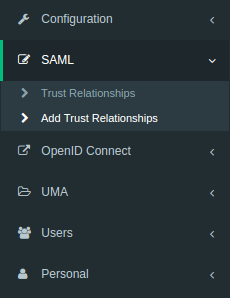
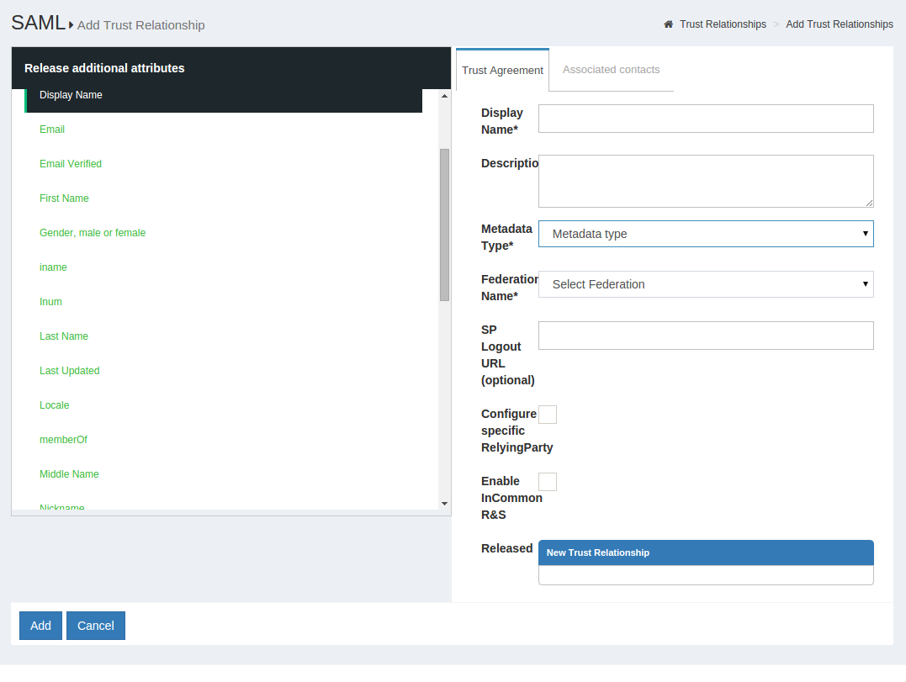
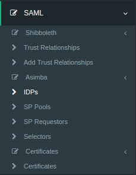

# SAML
## Overview
SAML is an XML-based, open-standard data format for exchanging authentication and authorization data between an identity provider (like the Gluu Server) and a service provider (like Salesforce, O365, etc.). SAML is stable and well supported at many of the Internet's largest providers. However, the last major release of SAML was in 2005! Therefore it is important to understand when to use SAML and when to use a newer protocol like OpenID Connect to achieve your identity goals. 

In short, refer to these three considerations to determine if you should use SAML:

- If you have an application that already supports SAML–use SAML!
- If you have a mobile application, use OpenID Connect.
- If you are writing a new application, use OpenID Connect.

If you are continuing with this SAML documentation it is presumed that your use case aligns with number one above. If not, we recommend that you review the [OpenID Connect](./openid-connect.md) portion of the Gluu Server docs. 
 
## Outbound SAML
Outbound SAML can also be called SP-initiated Single Sign-On (SSO) 
or traditional SAML. In an outbound SAML transaction a website or application (SP) 
redirects a user to a designated Identity Provider (IDP) for authentication 
and authorization. The IDP will ask for the user's credentials and upon successful 
authentication, the user is sent back to the SP logged in. 

In order for this transaction to happen successfully there must be pre-established 
trust between the IDP and the SP. In the Gluu Server, the IDPs SSO configuration is 
called a Trust Relationship (TR). The following sections cover how to create a TR in the Gluu Server. 

!!! Note
    For any SAML transaction, a trust relationship must be created in the IDP.

### Trust Relationship Requirements     
Each Trust Relationship requires the infomation listed below.

**Metadata of the SP**       
Metadata is an XML file which has configuration data used to establish trust between the website (SP) and IDP (Gluu Server). Websites (SP) can provide metadata via a URL or as a separate file. Metadata can change, so a static URL typically requires the least amount of ongoing maintenance. 
  
**Required Attributes**      
Each SP may require one or many attributes in order to grant a user access. 
Required attributes vary depending on the application, and should be 
explicitly listed in the application's documentation. The Gluu Server ships with 
certain preconfigured attributes and also supports the creation of custom attributes. 
Once the attributes are available in the Gluu Server, the administrator only needs 
to click on the desired attribute(s) and it will be released to the SP upon 
successful user authentication.

## SAML Attributes

## Attrubute in oxTrust
An *Active* attribute list can be seen from the Configuration > Attributes section.


The Gluu Server has a large LDAP tree which includes all standard
attributes. It is not necessary for all of them to be *Active*. The
active LDAP trees can be sorted using the *Show only Active Attributes*
link.


The Gluu Server administrator can make changes, such as changing the
status to active/inactive, to an attribute after clicking on it.


Additional custom attributes can be added in below way

 - Add custom attribute to /opt/gluu/schema/openldap/custom.schema 
   - In this below example 'customTest' is our custom attribute : 
```
attributetype ( oxAttribute:1003 NAME 'customTest'
        SUBSTR caseIgnoreSubstringsMatch EQUALITY caseIgnoreMatch
        SYNTAX 1.3.6.1.4.1.1466.115.121.1.15        
       X-ORIGIN 'Gluu - custom person attribute' )
```
 - Add custom attribute to gluuCustomPerson objectClass
   - Example: 
```
objectclass ( oxObjectClass:101 NAME 'gluuCustomPerson' SUP top AUXILIARY MAY (customTest) X-ORIGIN 'Gluu - Custom persom objectclass' )

```
 - Stop LDAP server with command `service solserver stop`
 - Create custom configuration holder with `mkdir -p /opt/symas/etc/openldap/slapd.d`
 - Test custom configuration with `/opt/symas/bin/slaptest -f /opt/symas/etc/openldap/slapd.conf -F /opt/symas/etc/openldap/slapd.d`
 - Start LDAP server with command `service solserver start`

Register new attribute with Gluu Server GUI, oxTrust, by
clicking the **Register Attribute** button. Then, the following screen will
appear:


* _Name:_ This field defines the name of the custom attribute which must
  be unique in the Gluu Server LDAP tree.

* _SAML1 URI:_ This field contains the SAML1 uri for the custom attribute.

* _SAML2 URI:_ This field contains the SAML2 uri for the custom attribute.

* _Display Name:_ This display name can be anything that is human readable.

* _Type:_ The attribute type should be selected from the drop-down menu.
  There are four attribute types supported by Gluu:
  1. Text
  2. Numeric
  3. Photo
  4. Date

* _Edit Type:_ This field controls which type of an user is allowed to edit
  corresponding attribute at his/her "Profile" page of the web UI (when feature
"User can edit own profile" is enabled).

* _View Type:_ This field controls which type of an user is allowed to view
  corresponding attribute at his/her "Profile" page of the web UI.

* _Privacy Level:_ Please select the desired privacy level from the
  drop-down menu. The privacy level has a specific range of 1 to 5.

* _Multivalued:_ Please select multivalue in this field if the attribute
  contains more than one value.

* _SCIM Attributes:_ If the attribute is a part of SCIM architecture select true.

* _Description:_ This contains a few words to describe the attribute.

* _Status:_ The status, when selected active, will release and publish
  the attribute in IdP.

  ## Custom NameID
  Gluu Server comes with the `transientID` attribute which is the default `NameID`.
  If there are other `NameID` requirements, it is possible to create them as well.
  The custom attribute must be created in oxTrust first before defining it as the `NameID`.
  Please see the [oxTrust custom attribute guide](#using-oxtrust) to create the custom attribute in oxTrust.

  ## Defining NameID
  The template file for `NameID` definitions are located in the `attribute-resolver.xml.vm` file under `/opt/gluu/jetty/identity/conf/shibboleth3/idp/`.
  The example below adds `testcustomattribute` as `NameID` based on UID attribute. The following are put into the `attribute-resolver.xml.vm` file.

  * Add declaration for the new attribute
  ```
  if( ! ($attribute.name.equals('transientId') or $attribute.name.equals('testcustomattribute') ) )
  ```
  * Add definition for the new attribute
```
 <resolver:AttributeDefinition id="testcustomattribute" xsi:type="Simple"
                              xmlns="urn:mace:shibboleth:2.0:resolver:ad"
                              sourceAttributeID="uid">

        <resolver:Dependency ref="siteLDAP"/>
        <resolver:AttributeEncoder xsi:type="SAML2StringNameID"
                                xmlns="urn:mace:shibboleth:2.0:attribute:encoder"
                                nameFormat="urn:oasis:names:tc:SAML:2.0:nameid-format:persistent" />
</resolver:AttributeDefinition> 
```
* Restart identity service using below command

` service identity restart` 

However it is recommended to stop and start service using 

`service identity stop`

`service identity start`


**SSO Testing Endpoint**       
Every website (SP) should have both a staging and a production URI
endpoint which can be checked for SSO. It's important to thoroughly test all scenarios in a development environment before moving the configuration into production. 

### Create a Trust Relationship in the Gluu Server       
* Go to SAML → Trust Relationships
* Click on “Add Relationship”



* A new page will appear where you can provide all the required information to create a Trust
  Relationship.



* _Display Name_: Name of the Trust Relationship (it should be unique for every trust relationship)     
* _Description_: Little description. Purpose and SSO link can be added here.    
* _Metadata Type_: There are four available options to choose from. The correct Type depends on how the SP is delivering Metadata to your IDP.      
    * _File_: Choose File if the SP has provided an uploadable metadata document in XML format.
    * _URI_: Chose URI if the SP metadata is hosted on a URI that is accessible from the Internet.
    * _Generate_: Choose Generate if the SP is an "inhouse application" or the “Shibboleth SP” is going to be installed in the target application (SP). This option will generate a how-to guide for installing the Shibboleth SP. If you plan on using the Generate method, please note the following:          
            * _URL_ : This is the hostname of the SP.     
            * _Public certificate_ : You must provide the certificate, which is a Base64 encoded ASCII file, and contain "-----BEGIN CERTIFICATE-----" and "-----END CERTIFICATE-----". This certificate **can not** be password protected.               
            * After creating the Trust Relationship, download the generated configuration files from the `Download Shibboleth2 configuration files` link and place these configuration files inside your SP configuration.         
    * _Federation_: Choose this option if the target application (SP) is affiliated with a federation service (e.g. InCommon, NJEdge etc.). Once you select “Federation” as the Metadata Type, another drop down menu called “Select Federation” will appear. From this drop menu you can select the appropriate federation. After selecting the “Federation Name”, a new link called “Click to select
entity id” will appear. Use this link to find and select the SP entityIDs that you wish to create SSO with. Learn how to establish trust with a federation [below](#federation-configuration).     

* _Released_: The SPs required attributes must be added to this panel. The required attributes can be selected from the menu on the left with the heading “Release Additional Attributes”.     

The TR is added by clicking the `Add` button located in the lower left side of the page.     

### Relying Party Configuration     
If the target application does not already support SAML, the Relying Party software must be configured. The relying party configuration is accessible on the TR Creation page. The checkbox `Configure specific Relying Party` must be checked.     

     

The checkbox will result in a link which can be accessed to find information about configuring the relying party for the TR. The image below shows the relying party config panel from which the administrator can add the specific option.     

     

!!! Note     
    If the target application does not already support a federation standard like SAML, and you or the developer are planning on adding federation to the application, we strongly recommend using OpenID Connect rather than SAML. OpenID Connect is newer, easier to use, and follows modern best practices. Learn more in our blog: [OAuth vs. SAML vs. OpenID Connect](http://gluu.co/oauth-saml-openid).
    
### Federation Configuration     
If the SP is part of an identity federation such as InCommon, the administrator must add the federation as an SP in the Gluu Server. This will enable the administrator to more easily create TRs with SPs in the federation. The example below shows how an administrator would add a TR for the InCommon Federation.


Once a TR has been established with the federation, the Gluu Server administrator can easily create TRs with any SP included in the federation by selecting the federation from the `Federation Name` drop down menu and selecting the entity-id for the SP.


## Inbound SAML     
Inbound SAML allows users from external identity providers to SSO into services protected by the Gluu Server. The Gluu Server uses an open source product called [Asimba](http://www.asimba.org/site/) to achieve inbound SAML. Asimba allows SPs to use a single IDP for SSO even when users come from multiple trusted external IDPs. 

The Gluu Server is shipped with a SAML Script which simplifies the process of using Asimba. This section provides a step-by-step method of configuring Asimba with two (2) IDPs and a single SP. The administrator can add multiple IDPs or SPs if required using the same method. However, it is required that all SPs and IDPs are connected to the Asimba server, or the IDP that has the Asimba module enabled.
i

### Required Setup     

|Setup hostname|Description|
|--------------|-----------|
|https://sp.gluu.org/protected/print.py|This is a shibboleth SP connected to _https://test.gluu.org_|
|https://test.gluu.org| This is a Gluu Server SAML IDP with Asimba|
|https://nest.gluu.org|This is a second Gluu Server SAML IDP connected to _https://test.gluu.org_ |


**Note: Description of SAML Authentication Module is available here: 
https://github.com/GluuFederation/oxAuth/tree/master/Server/integrations/saml**

### Specific Setup Details     
The Gluu Server setup with the hostname `https://test.gluu.org` must be setup with Asimba. This is done by typing `yes` to the [setup script prompt](../installation-guide/setup_py.md).


### Custom Script Configuration     

**Note: The configuration below is done in the Gluu Server with Asimba 
installed with the hostname `https://test.gluu.org`.**

* Log into the oxTrust interface as `admin`

* Navigate to Configuration --> Manage Custom Scripts


* Select/Add `saml` script from `Person Authentication` tab


   - Name: saml
    - Description: Saml Authentication module
    - Programming Language: Python
    - Level: 1
    - Location Type: LDAP
    - Usage Type: Web
    - Custom property (key/value)
       - saml_deployment_type: enroll
       - saml_idp_sso_target_url: https://test.gluu.org/asimba/profiles/saml2/sso/web
       - saml_validate_response: false
       - asimba_entity_id: https://test.gluu.org/saml
       - asimba_saml_certificate_file: /etc/certs/saml.pem 
         - note: Deployer need to copy 'asimba.crt' in 'saml.pem' without the 'BEGIN CERTIFICATE' and 'END CERTIFICATE' tag. 
       - user_object_classes: eduPerson
       - saml_idp_attributes_mapping: { "attribute_name": ["attribute_name", "SAML2 URI"] } 
         - example: ```{"uid": ["uid", "urn:oid:0.9.2342.19200300.100.1.1"], "mail": ["mail", "urn:oid:0.9.2342.19200300.100.1.3"], "givenName": ["givenName", "urn:oid:2.5.4.42"], "sn": ["sn", "urn:oid:2.5.4.4"], "eduPersonPrincipalName": ["eduPersonPrincipalName", "urn:oid:1.3.6.1.4.1.5923.1.1.1.6"] } ```
       - enforce_uniqueness_attr_list: attribute1, attribute2
         - example: ```edupersonprincipalname, uid, mail, givenName```
       - saml_use_authn_context: false
       - saml_generate_name_id: true
    - Script: Please copy the [SAML Script](https://github.com/GluuFederation/oxAuth/blob/master/Server/integrations/saml/SamlExternalAuthenticator.py) from Github. 
    - Enabled: True


### Adding IDP in Asimba Server     

**Note: The configuration below is done in the Gluu Server      
with Asimba installed with the hostname `https://test.gluu.org`.**

* Log into the oxTrust interface

* Navigate to SAML --> Idp



* Click on 'Add IDP' button


* Fill up the form with the information below:
    
    * ID: The entityID of the remote ID/ADFS 

        - Example: `https:<hostname_of_gluu_server>/idp/shibboleth`  

    * Friendly Name: There is no particular format for this field, use anything 

    * Metadata URL: Keep it blank, we will upload metadata

    * Metadata Timeout: Keep it as it is. 

    * Metadata File: Download metadata of remote IDP/ADFS and upload that XML file. 
    
        - Example: The metadata for Gluu IdP can be downloaded using `wget -c https:<hostname_of_gluu_server>/idp/shibboleth`

    * Trust Certificate File: Grab the SAML cert from remote IDP/ADFS and upload that x509 certificate

        - Example: You will get the SAML certificate from Gluu Server's metadata link or available inside `/etc/certs/shibIDP.crt`

    * NameIDFormat: SAML2 URI nameID format if remote IDP is a Gluu Server otherwise ask for their nameID format.

        - Example: `urn:oasis:names:tc:SAML:2.0:nameid-format:transient'

    * Enabled: Yes

    * Send Scoping: Yes

    * AllowCreate: Yes

    * Disable SSO for IDP: No

    * ACS index: Yes

    * Send NameIDPolicy: Yes

    * Avoid Subject Confirmations: No


### Adding SP Requestor in Asimba Server
* Log into oxTrust interface

* Navigate to SAML --> SP Requestor


* Click on 'Add SP Requestor'


* Please fill up the form with the information below:
     - Select parent SP Pool: requestorpool.1
     - ID: https://test.gluu.org/saml
     - Friendly Name: oxAuth SAML
     - Metadata URL: Not required
     - Metadata Timeout: -1
     - Metadata File: Create a SAML metadata like below and save it as 'saml_oxauth_metadata.xml'. Upload this metadata. 
     - Trust Certificate File: Not required
     - Properties: Not required
     - Enabled: Yes
     - Signing: No
     - metadata snippet: 
``` 
<md:EntityDescriptor xmlns:md="urn:oasis:names:tc:SAML:2.0:metadata" entityID="https://test.gluu.org/saml">
  <md:SPSSODescriptor protocolSupportEnumeration="urn:oasis:names:tc:SAML:2.0:protocol">
    <md:AssertionConsumerService Binding="urn:oasis:names:tc:SAML:2.0:bindings:HTTP-POST" Location="https://test.gluu.org/oxauth/postlogin" index="0"/>
  </md:SPSSODescriptor>
  <md:Organization>
    <md:OrganizationName xml:lang="en">Gluu</md:OrganizationName>
    <md:OrganizationDisplayName xml:lang="en">Gluu - Open Source Access Management</md:OrganizationDisplayName>
    <md:OrganizationURL xml:lang="en">http://www.gluu.org</md:OrganizationURL>
  </md:Organization>
  <md:ContactPerson contactType="technical">
    <md:GivenName>Administrator</md:GivenName>
    <md:EmailAddress>support@gluu.org</md:EmailAddress>
  </md:ContactPerson>
</md:EntityDescriptor> 
```


### Trust Relationship      
**Note: The configuration below is done in the Gluu Server 
with Asimba installed with the hostname `https://test.gluu.org`.**

Create Trust relationships for all service provides which are included in SAML Proxy SSO workflow. In our test setup we created Trust relationship for remote SP which has entityID 'https://sp.gluu.org/shibboleth'. How to create Trust Relationship is available in [Section 2.1](#2.1-outbound-saml).

Log into the oxTrust inteface and follow the steps to add a new Trust Relationship.

  - Gluu Server's Asimba metadata can be achieved from 'https://test.gluu.org/asimba/profiles/saml2'
    - Download the metadata and use 'File' method to create Trust relationship
  - Relying Party Configuration: 'SAML2SSO' Profile 


    - example: 
        - includeAttributeStatement: Yes
        - assertionLifeTime: 300000
        - assertionProxyCount: 0
        - signResponses: conditional
        - signAssertions: never
        - signRequests: conditional
        - encryptAssertions: never
        - encryptNameIds: never
  - Attribute: Any attribute Service Providers require. Any kind of nameID from below list is mandatory. 
     - nameID: 
        - `nameIDFormat="urn:oasis:names:tc:SAML:1.1:nameid-format:unspecified"`
        - `nameIDFormat="urn:oasis:names:tc:SAML:2.0:nameid-format:transient"`
        - `nameIDFormat="urn:oasis:names:tc:SAML:1.1:nameid-format:emailAddress"`
     - How to create nameID in Gluu Server is available [here](https://gluu.org/docs/customize/attributes/#custom-nameid)

### Test Asimba with SAML Proxy
Here is a quick video on how SAML Proxy SSO might look like. Here in this video we are using 'https://sp.gluu.org/protected/print.py' as our protected service provider link. After initiating the SSO, we are moved to Gluu Server's SAML Proxy discovery page ( https://test.gluu.org ). From there we selected 'Nest' as our desired authentication server. After succesful authentication we are landing to proctected resource. 

* [Youtube Video Link](https://youtu.be/YEyrOWJu0yo)
