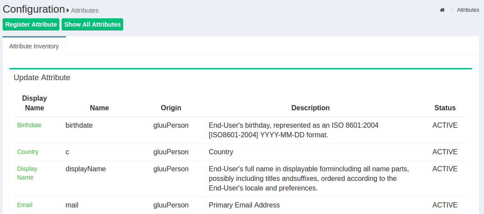
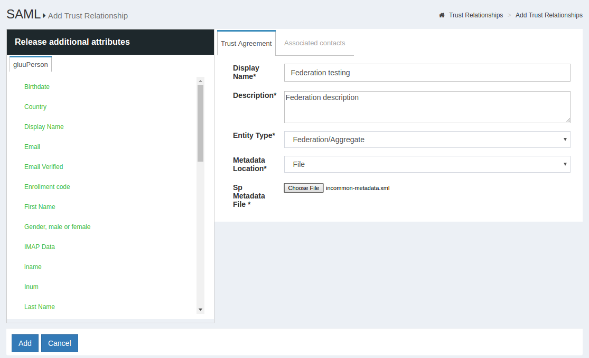
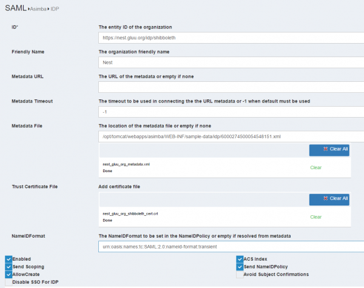
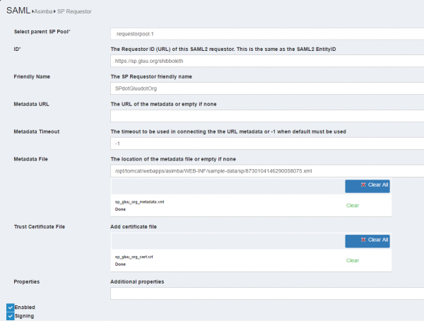
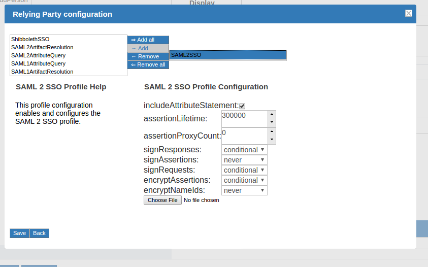

# SAML
## Overview
SAML is an XML-based, open-standard data format for exchanging 
authentication and authorization data between an identity provider 
(like the Gluu Server) and a service provider (like Dropbox, O365, etc.). 
SAML is a stable and mature standard, and is well supported at many of the 
Internet's largest domains. However, the last major release of SAML was in 2005! 
Therefore it is important to understand when to use SAML and when to use a 
newer protocol like OpenID Connect to achieve your identity goals. 

In short, refer to these four considerations to determine which protocol 
to use for single sign-on (SSO):

- If you have an application that already supports SAML, use SAML.
- If you need to support user login at an external IDP (like a customer or partner IDP), use SAML.
- If you have a mobile application, use OpenID Connect.
- If you are writing a new application, use OpenID Connect.

If you are continuing with the SAML documentation it is presumed your use case aligns with one or both of the first two bullet points above. If not, we recommend that you review the [OpenID Connect](./openid-connect.md) portion of the Gluu Server docs. 

### Outbound vs. Inbound SAML 
SAML is a versatile protocol. The two main use cases are Outbound SAML and Inbound SAML. 
Outbound SAML can also be called SP-initiated Single Sign-On (SSO) or traditional SAML. 
In an outbound SAML transaction a website or application (SP) redirects a user to a 
designated Identity Provider (IDP) for authentication and authorization. 
The IDP will ask for the user's credentials and upon successful authentication, 
the user is sent back to the SP logged in. 

Inbound SAML enables an organization to offer SAML authentication as a front door 
to their digital service. Using Inbound SAML, an organization can create trust 
with many IDPs (typically the IDPs of customer and/or partner organizations) in 
order to enable users from those organizations to authenticate at their home 
identity provider for access to the service. Inbound SAML is a common requirement 
for SaaS providers who want to make sure they can support the authentication requirements 
of large enterprise customers.

The Gluu Server bundles separate components to support both use cases 
(installation of both components is optional during Gluu Server deployment). 
For Outbound SAML, the Gluu Server bundles the Shibboleth IDP. 
For inbound SAML, the Gluu Server bundles the Asimba SAML Proxy. 
Documentation for each service follows in the sections below. 
 
## Outbound SAML (Shibboleth)
Outbound SAML can also be called SP-initiated Single Sign-On (SSO) 
or traditional SAML. In an outbound SAML transaction a website or application (SP) 
redirects a user to a designated Identity Provider (IDP) for authentication 
and authorization. The IDP will ask for the user's credentials and upon successful 
authentication, the user is sent back to the SP logged in. 

In order for this transaction to happen successfully there must be pre-established 
trust between the IDP and the SP. In the Gluu Server, the IDPs SSO configuration is 
called a Trust Relationship (TR). The following sections cover how to create a TR in the Gluu Server. 

!!! Note
    For any outbound SAML transaction, a trust relationship must be created in the IDP.

### Trust Relationship Requirements     
Each Trust Relationship requires the infomation listed below.

**Metadata of the SP**       
Metadata is an XML file which has configuration data used to establish trust between the website (SP) and IDP (Gluu Server). Websites (SP) can provide metadata via a URL or as a separate file. Metadata can change, so a static URL typically requires the least amount of ongoing maintenance. 
  
**Required Attributes**      
Each SP may require one or many attributes in order to grant a user access. 
Required attributes vary depending on the application, and should be 
explicitly listed in the application's documentation. The Gluu Server ships with 
certain preconfigured attributes and also supports the creation of custom attributes. 
Once the attributes are available in the Gluu Server, the administrator only needs 
to click on the desired attribute(s) and it will be released to the SP upon 
successful user authentication.

### SAML Attributes

### Attrubute in oxTrust
An *Active* attribute list can be seen from the Configuration > Attributes section.



The Gluu Server has a large LDAP tree which includes all standard
attributes. It is not necessary for all of them to be *Active*. The
active LDAP trees can be sorted using the *Show only Active Attributes*
link.


The Gluu Server administrator can make changes, such as changing the
status to active/inactive, to an attribute after clicking on it.


Additional custom attributes can be added in below way

 - Add custom attribute to /opt/gluu/schema/openldap/custom.schema 
   - In this below example 'customTest' is our custom attribute : 
```
attributetype ( oxAttribute:1003 NAME 'customTest'
        SUBSTR caseIgnoreSubstringsMatch EQUALITY caseIgnoreMatch
        SYNTAX 1.3.6.1.4.1.1466.115.121.1.15        
       X-ORIGIN 'Gluu - custom person attribute' )
```
 - Add custom attribute to gluuCustomPerson objectClass
   - Example: 
```
objectclass ( oxObjectClass:101 NAME 'gluuCustomPerson' SUP top AUXILIARY MAY (customTest) X-ORIGIN 'Gluu - Custom person objectclass' )

```
 - Stop LDAP server with command `service solserver stop`
 - Create custom configuration holder with `mkdir -p /opt/symas/etc/openldap/slapd.d`
 - Test custom configuration with `/opt/symas/bin/slaptest -f /opt/symas/etc/openldap/slapd.conf -F /opt/symas/etc/openldap/slapd.d`
 - Start LDAP server with command `service solserver start`

Register new attribute with Gluu Server GUI, oxTrust, by
clicking the **Register Attribute** button. Then, the following screen will
appear:


* _Name:_ This field defines the name of the custom attribute which must
  be unique in the Gluu Server LDAP tree.

* _SAML1 URI:_ This field contains the SAML1 uri for the custom attribute.

* _SAML2 URI:_ This field contains the SAML2 uri for the custom attribute.

* _Display Name:_ This display name can be anything that is human readable.

* _Type:_ The attribute type should be selected from the drop-down menu.
  There are four attribute types supported by Gluu:
  1. Text
  2. Numeric
  3. Photo
  4. Date

* _Edit Type:_ This field controls which type of an user is allowed to edit
  corresponding attribute at his/her "Profile" page of the web UI (when feature
"User can edit own profile" is enabled).

* _View Type:_ This field controls which type of an user is allowed to view
  corresponding attribute at his/her "Profile" page of the web UI.

* _Privacy Level:_ Please select the desired privacy level from the
  drop-down menu. The privacy level has a specific range of 1 to 5.

* _Multivalued:_ Please select multivalue in this field if the attribute
  contains more than one value.

* _SCIM Attributes:_ If the attribute is a part of SCIM architecture select true.

* _Description:_ This contains a few words to describe the attribute.

* _Status:_ The status, when selected active, will release and publish
  the attribute in IdP.

### Custom NameID
Gluu Server comes with the `transientID` attribute which is the default `NameID`.
If there are other `NameID` requirements, it is possible to create them as well.
The custom attribute must be created in oxTrust first before defining it as the `NameID`.
Please see the [oxTrust custom attribute guide](#using-oxtrust) to create the custom attribute in oxTrust.

### Defining NameID
  The template file for `NameID` definitions are located in the `attribute-resolver.xml.vm` file under `/opt/gluu/jetty/identity/conf/shibboleth3/idp/`.
  The example below adds `testcustomattribute` as `NameID` based on UID attribute. The following are put into the `attribute-resolver.xml.vm` file.

  * Add declaration for the new attribute
  ```
  if( ! ($attribute.name.equals('transientId') or $attribute.name.equals('testcustomattribute') ) )
  ```
  * Add definition for the new attribute
```
 <resolver:AttributeDefinition id="testcustomattribute" xsi:type="Simple"
                              xmlns="urn:mace:shibboleth:2.0:resolver:ad"
                              sourceAttributeID="uid">

        <resolver:Dependency ref="siteLDAP"/>
        <resolver:AttributeEncoder xsi:type="SAML2StringNameID"
                                xmlns="urn:mace:shibboleth:2.0:attribute:encoder"
                                nameFormat="urn:oasis:names:tc:SAML:2.0:nameid-format:persistent" />
</resolver:AttributeDefinition> 
```
* Restart identity service using below command

` service identity restart` 

However it is recommended to stop and start service using 

`service identity stop`

`service identity start`

### Create a Trust Relationship in the Gluu Server       
* Go to `SAML` > `Trust Relationships`
* Click on `Add Trust Relationship`
* A new page will appear where you can provide all the required information to create a Trust
  Relationship(TR).


* _Display Name_: Name of the Trust Relationship (it should be unique for every trust relationship)     
* _Description_: Little description. Purpose and SSO link can be added here.    
* _Metadata Type_: There are four available options to choose from. The correct Type depends on how the SP is delivering Metadata to your IDP.      
    * _File_: Choose File if the SP has provided an uploadable metadata document in XML format.
    * _URI_: Chose URI if the SP metadata is hosted on a URI that is accessible from the Internet.
    * _Generate_: Choose Generate if the SP is an "inhouse application" or the “Shibboleth SP” is going to be installed in the target application (SP). This option will generate a how-to guide for installing the Shibboleth SP. If you plan on using the Generate method, please note the following:          
            * _URL_ : This is the hostname of the SP.     
            * _Public certificate_ : You must provide the certificate, which is a Base64 encoded ASCII file, and contain "-----BEGIN CERTIFICATE-----" and "-----END CERTIFICATE-----". This certificate **can not** be password protected.               
            * After creating the Trust Relationship, download the generated configuration files from the `Download Shibboleth2 configuration files` link and place these configuration files inside your SP configuration.         
    * _Federation_: Choose this option if the target application (SP) is affiliated with a federation service (e.g. InCommon, NJEdge etc.). Once you select “Federation” as the Metadata Type, another drop down menu called “Select Federation” will appear. From this drop menu you can select the appropriate federation. After selecting the “Federation Name”, a new link called “Click to select
entity id” will appear. Use this link to find and select the SP entityIDs that you wish to create SSO with. Learn how to establish trust with a federation [below](#federation-configuration).     

* _Released_: The SPs required attributes must be added to this panel. The required attributes can be selected from the menu on the left with the heading “Release Additional Attributes”.     

The Trust Relationship(TR) is added by clicking the `Add` button located in the lower left side of the page.     

### Relying Party Configuration     
If the target application does not already support SAML, the Relying Party software must be configured. The relying party configuration is accessible on the TR Creation page. The checkbox `Configure specific Relying Party` must be checked.     

     

The checkbox will result in a link which can be accessed to find information about configuring the relying party for the TR. The image below shows the relying party config panel from which the administrator can add the specific option.     

     

!!! Note     
    If the target application does not already support a federation standard like SAML, and you or the developer are planning on adding federation to the application, we strongly recommend using OpenID Connect rather than SAML. OpenID Connect is newer, easier to use, and follows modern best practices. Learn more in our blog: [OAuth vs. SAML vs. OpenID Connect](http://gluu.co/oauth-saml-openid).
    
### Federation Configuration     
If the SP is part of an identity federation such as InCommon, the administrator must add the federation as an SP in the Gluu Server. This will enable the administrator to more easily create TRs with SPs in the federation. The example below shows how an administrator would add a TR for the InCommon Federation.



Once a TR has been established with the federation, the Gluu Server administrator can easily create TRs with any SP included in the federation by selecting the federation from the `Federation Name` drop down menu and selecting the entity-id for the SP.


## Inbound SAML (Asimba)
Inbound SAML allows users from external domains to login at their home identity provider to gain access to resources protected by the Gluu Server. The Gluu Server uses an open source product called [Asimba](http://www.asimba.org/site/) to normalize inbound SAML. 

The following documentation provides a step-by-step guide for configuring Asimba with two (2) IDPs and a single (1) SP. The guide includes use of a SAML interception script which is shipped with the Gluu Server and simplifies the process of using Asimba. The administrator can add multiple IDPs or SPs (as required) using the method outlined below. Each SP and IDP must be connected to the IDP that has the Asimba module enabled.

!!! Note 
    A description of the SAML interception script is available [here](https://github.com/GluuFederation/oxAuth/tree/master/Server/integrations/saml).


  
### Required Setup     

|Setup hostname|Description|
|--------------|-----------|
|`https://sp.gluu.org/protected/print.py`| This is a shibboleth SP connected to `https://test.gluu.org`|
|`https://test.gluu.org`| This is a Gluu Server with Asimba installed|
|`https://nest.gluu.org`| This is a second Gluu Server with Shibboleth installed that is connected to `https://test.gluu.org`|
  
The Gluu Server with hostname `https://test.gluu.org` must include Asimba. The Gluu Server with hostname `https://nest.gluu.org` must include Shibboleth. This is done by entering `yes` to the respective options while running the [setup script prompt](../installation-guide/setup_py.md) during installation. 

### Add Custom Script

Login to the Gluu Server with hostname `https://test.gluu.org` and add the SAML script: 

* Log into the oxTrust interface as `admin`
* Navigate to `Configuration` > `Manage Custom Scripts`
* In the `Person Authentication` tab Select/Add `saml` script 


   - Name: saml
    - Description: Saml Authentication module
    - Programming Language: Python
    - Level: 1
    - Location Type: LDAP
    - Usage Type: Web
    - Custom property (key/value)
       - saml_deployment_type: enroll
       - saml_idp_sso_target_url: `https://test.gluu.org/asimba/profiles/saml2/sso/web`
       - saml_validate_response: false
       - asimba_entity_id: `https://test.gluu.org/saml`
       - asimba_saml_certificate_file: `/etc/certs/saml.pem`
         - note: Deployer need to copy 'asimba.crt' in 'saml.pem' without the 'BEGIN CERTIFICATE' and 'END CERTIFICATE' tag. 
       - user_object_classes: `eduPerson`
       - saml_idp_attributes_mapping: { "attribute_name": ["attribute_name", "SAML2 URI"] } 
         - example: ```{"uid": ["uid", "urn:oid:0.9.2342.19200300.100.1.1"], "mail": ["mail", "urn:oid:0.9.2342.19200300.100.1.3"], "givenName": ["givenName", "urn:oid:2.5.4.42"], "sn": ["sn", "urn:oid:2.5.4.4"], "eduPersonPrincipalName": ["eduPersonPrincipalName", "urn:oid:1.3.6.1.4.1.5923.1.1.1.6"] } ```
       - enforce_uniqueness_attr_list: `attribute1`, `attribute2`
         - example: ```edupersonprincipalname, uid, mail, givenName```
       - saml_use_authn_context: false
       - saml_generate_name_id: true
    - Script: Please copy the [SAML Script](https://github.com/GluuFederation/oxAuth/blob/master/Server/integrations/saml/SamlExternalAuthenticator.py) from Github. 
    - Enabled: True

### Add External IDP    

Login to the Gluu Server with hostname `https://test.gluu.org` and add the external IDP: 

* Log into the oxTrust interface
* Navigate to `SAML` > `IDP`
* Click `Add IDP`    
  
* Fill in the form with the following information:

    * ID: The entityID of the remote ID/ADFS 

        - Example: `https:nest.gluu.org/idp/shibboleth`  

    * Friendly Name: Provide a human-readable name, like an organization or site name.

    * Metadata URL: Leave this field blank, we will upload metadata

    * Metadata Timeout: Leave this field as is. 

    * Metadata File: Download the remote IDPs metadata and upload that XML file. 
    
        - Example: The metadata for a Gluu IDP can be downloaded using `wget -c https:<hostname_of_gluu_server>/idp/shibboleth`

    * Trust Certificate File: Get the SAML cert from the remote IDP and upload that x509 certificate

        - Example: You can get a Gluu Server's SAML certificate in the metadata or in `/etc/certs/shibIDP.crt`

    * NameIDFormat: If the remote IDP is a Gluu Server use SAML2 URI nameID format. If not ask for the nameID format.

        - Example: `urn:oasis:names:tc:SAML:2.0:nameid-format:transient`

    * Enabled: Yes

    * Send Scoping: Yes

    * AllowCreate: Yes

    * Disable SSO for IDP: No

    * ACS index: Yes

    * Send NameIDPolicy: Yes

    * Avoid Subject Confirmations: No

### Add SP Requestor

Login to the Gluu Server with hostname `https://test.gluu.org` and add the SP Requestor: 

* Log into oxTrust interface
* Navigate to `SAML` > `SP Requestor`
* Click `Add SP Requestor`

* Fill in the form with the information below:
     - Select parent SP Pool: requestorpool.1
     - ID: https://test.gluu.org/saml
     - Friendly Name: oxAuth SAML
     - Metadata URL: Not required
     - Metadata Timeout: -1
     - Metadata File: Create a SAML metadata like below and save it as 'saml_oxauth_metadata.xml'. Upload this metadata. 
     - Trust Certificate File: Not required
     - Properties: Not required
     - Enabled: Yes
     - Signing: No
     - metadata snippet: 
``` 
<md:EntityDescriptor xmlns:md="urn:oasis:names:tc:SAML:2.0:metadata" entityID="https://test.gluu.org/saml">
  <md:SPSSODescriptor protocolSupportEnumeration="urn:oasis:names:tc:SAML:2.0:protocol">
    <md:AssertionConsumerService Binding="urn:oasis:names:tc:SAML:2.0:bindings:HTTP-POST" Location="https://test.gluu.org/oxauth/postlogin" index="0"/>
  </md:SPSSODescriptor>
  <md:Organization>
    <md:OrganizationName xml:lang="en">Gluu</md:OrganizationName>
    <md:OrganizationDisplayName xml:lang="en">Gluu - Open Source Access Management</md:OrganizationDisplayName>
    <md:OrganizationURL xml:lang="en">http://www.gluu.org</md:OrganizationURL>
  </md:Organization>
  <md:ContactPerson contactType="technical">
    <md:GivenName>Administrator</md:GivenName>
    <md:EmailAddress>support@gluu.org</md:EmailAddress>
  </md:ContactPerson>
</md:EntityDescriptor> 
```

### Add Trust Relationship

Login to the Gluu Server with hostname `https://nest.gluu.org` and create a Trust Relationship for all SPs which are included in the SAML Proxy SSO workflow. Documentation for creating a Trust Relationship is available in [Section 2.1](#2.1-outbound-saml). 

In our test setup we have created a Trust Relationship for one remote SP with the entityID `https://sp.gluu.org/shibboleth`.

  - The Asimba metadata can be retrieved and downloaded from `https://test.gluu.org/asimba/profiles/saml2`
  - While creating the Trust Relationship, choose `File` as the `Metadata Type` and upload the Asumba metadata. 
  - Relying Party Configuration: `SAML2SSO` Profile 




    - example: 
        - includeAttributeStatement: Yes
        - assertionLifeTime: 300000
        - assertionProxyCount: 0
        - signResponses: conditional
        - signAssertions: never`
        - signRequests: conditional
        - encryptAssertions: never
        - encryptNameIds: never
  - Attribute: Any attribute Service Providers require. Any kind of nameID from below list is mandatory. 
     - nameID: 
        - `nameIDFormat="urn:oasis:names:tc:SAML:1.1:nameid-format:unspecified"`
        - `nameIDFormat="urn:oasis:names:tc:SAML:2.0:nameid-format:transient"`
        - `nameIDFormat="urn:oasis:names:tc:SAML:1.1:nameid-format:emailAddress"`
     - How to create nameID in Gluu Server is available [here](https://gluu.org/docs/customize/attributes/#custom-nameid)

### Test SSO
Here is a [quick video](https://youtu.be/YEyrOWJu0yo) to demonstrate how SSO should look with everything properly configured. In this video the protected resource is `https://sp.gluu.org/protected/print.py`. When we try to access the page SSO is initiated and we are redirected to the SAML Proxy discovery page on `https://test.gluu.org`. From there we select `Nest` as our desired authentication server and get directed to `https://nest.gluu.org/oxAuth/login`. After logging in we are redirected and able to access to the protected resource. 

* [Youtube Video Link](https://youtu.be/YEyrOWJu0yo)
